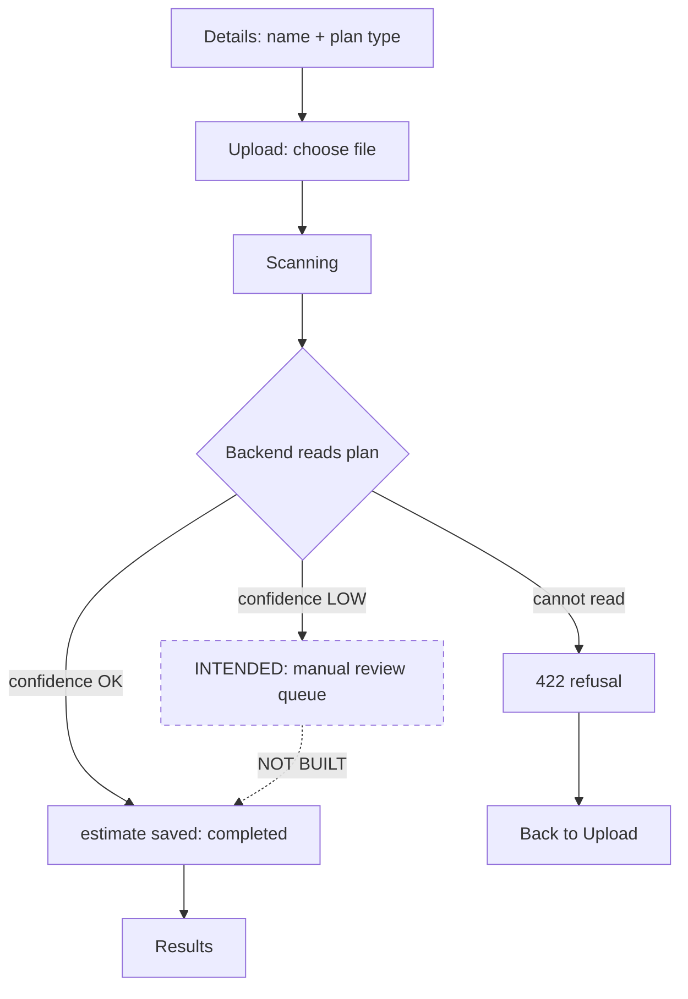
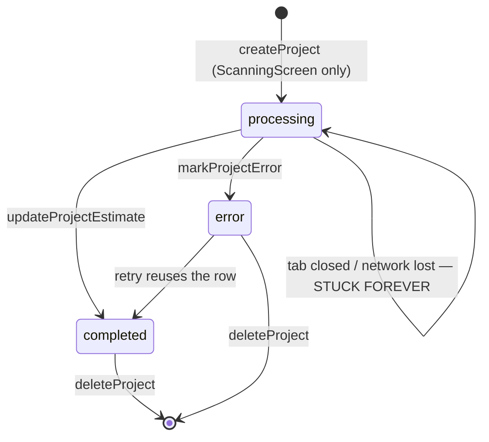

# TRACE — Feature Logic Audit

**Date:** 22 September 2026
**Scope:** business logic of every feature, frontend and backend.
**Method:** read-only. No source file was modified. Findings marked **Confirmed (reproduced)** were proved by executing code; **Confirmed (static)** are unambiguous from the code path; **Suspected** are reasoned but not reproduced.

---

## 1. Executive summary

TRACE's **estimation engine is the strongest part of the system** — deterministic, versioned, well tested (356 tests), and honest about its own assumptions. The weaknesses are almost entirely in the **layers around it**: access control, workflow state, and the gap between what the backend computes and what the user is shown.

### Readiness verdict

| Use | Verdict |
| --- | --- |
| Local demo / defence | **Ready**, with the caveats in §3 understood |
| Shared deployment (any public URL) | **Not ready.** AUTH-01 and API-02 are disqualifying |

> **Update, 24 Sep 2026 — API-01 is FIXED.** The store now refuses any template name that is not a plain single path segment and checks that the resolved path stays inside the template directory. The request that reproduced it now returns **400** and the target file survives; verified against a fresh server and pinned by `backend/tests/test_templates_store.py` (19 tests). 391 tests pass.

### Top 5 issues

1. **API-01 — Unauthenticated arbitrary file deletion. ✅ FIXED 24 Sep.** `DELETE /api/templates/{item_id}/{filename}` joined user input straight into a filesystem path, and an encoded backslash reached files outside the templates directory. **Reproduced before the fix, and re-run after it to confirm it no longer works.**
2. **AUTH-01 — There is no owner on a project.** The `projects` table has no `user_id`. A signed-in test account read **all 22 projects** in the database. Row-level security cannot scope by owner because there is no column to scope by. **Reproduced.**
3. **AUTH-02 — Logout does not log out.** The menu item navigates to `/sign-in` and never calls `supabase.auth.signOut()`. Nothing anywhere in `src/` calls it. The session survives in local storage.
4. **EST-01 — Materials the engine cannot price are invisible.** The backend collects them correctly; the frontend hardcodes an empty list when saving and renders the field nowhere. The grand total silently excludes them, which the requirements document explicitly forbids.
5. **EST-02 — Confidence is displayed but gates nothing.** A 0.55-confidence read is stored as `completed` and presented like a 0.95 one. The spec requires low-confidence extractions to route to review; no review path exists.

---

## 2. System overview

### What the app is supposed to do

An estimator signs in, creates a project, uploads one image of a floor, electrical or plumbing plan, and receives a line-item material estimate in Philippine pesos. Per [trace-system-requirements.md](trace-system-requirements.md), both input paths (CAD and image) should produce **one shared plan schema**; all quantity and cost maths must live in a **deterministic rule engine**, never in a model; and every stage involving uncertainty needs **a confidence check and a human review path**, never silent auto-acceptance (§1, §9). Unmatched materials must be **flagged, never silently dropped** (§5).

What is built is a slice: the image path only, with the rule engine and pricing complete and well covered. The CAD path, the job/queue infrastructure (§8), the persisted plan schema (§4), the review workflow (§9) and the explanation layer (§6) are not implemented.

### Feature map

| Feature | Screens | Backend | Tables |
| --- | --- | --- | --- |
| Auth | `/sign-in`, `/sign-up` | Supabase GoTrue | `auth.users` |
| Projects | `/projects`, `/projects/details` | — (direct Supabase) | `projects` |
| Scan & estimate | `/upload`, `/scanning` | `POST /api/estimate/image` | `projects` |
| Results | `/results` | — | `projects` |
| History | `/history` | — | `projects` |
| Symbol library | `/symbol-library` | `GET/POST/DELETE /api/templates` | filesystem |
| Train model | `/train-model` | none — simulated client-side | — |
| Materials | (library screen) | `GET /api/materials` | `materials` |
| Profile / Feedback / Help | `/profile`, `/feedback`, `/help` | — | none (not wired) |

### Intended vs actual scan flow



The dashed box is required by requirements §1 and §9 and does not exist. Every successful read, at any confidence, goes straight to `completed`.

### Project state machine, as built



There is no timeout, no reaper and no way for a user to clear a stuck `processing` row other than deleting it. `openProject()` refuses to open one ([ProjectsScreen.tsx:96](src/app/screens/ProjectsScreen.tsx#L96)).

---

## 3. Findings by feature

### Authentication & authorization

---

#### AUTH-01 — Projects have no owner; every user sees and can delete every project

**Severity: Critical** · **Confirmed (reproduced)**
**Location:** `projects` table schema; [src/lib/projects.ts:39-48](src/lib/projects.ts#L39-L48), [src/lib/projects.ts:104-108](src/lib/projects.ts#L104-L108), [src/lib/projects.ts:116-119](src/lib/projects.ts#L116-L119)

**What's wrong.** The live `projects` table has columns `id, name, description, plan_type, status, grand_total, line_items, unmatched_detections, error_message, created_at, updated_at, extraction`. **There is no `user_id` or owner column.** `createProject` never sets one. RLS therefore cannot restrict rows by owner — the only policy it can express is "any authenticated user, all rows".

**Evidence.** Signing in with the test account from `passwords.md` and selecting through the anon key:

```
--- anon, NOT signed in ---
  projects: 0 rows readable
  materials: 0 rows readable
--- signed in as asd@gmail.com ---
  projects: 22 rows readable
  materials: 52 rows readable
```

RLS *is* enabled and does block anonymous access — but any authenticated account reads the entire table.

**Scenario.** Two students each create an account for the same deployment. Each sees the other's projects on `/projects` and `/history`, can open their estimates, and can delete them through the card menu — which now deletes on the second click with no undo.

**Expected.** A project belongs to the account that created it; RLS scopes `select`, `update` and `delete` to `auth.uid()`.

**Fix.** Add `user_id uuid not null default auth.uid() references auth.users`, backfill or discard existing rows, and add per-operation RLS policies. Then filter in `listProjects`. **Effort: M** (schema + policies + backfill decision).

---

#### AUTH-02 — Logout does not end the session

**Severity: High** · **Confirmed (static)**
**Location:** [src/app/components/AppShell.tsx:63-68](src/app/components/AppShell.tsx#L63-L68)

**What's wrong.** The Logout menu item calls `navigate("/sign-in")` and nothing else. A repository-wide search finds **no call to `supabase.auth.signOut()` anywhere in `src/`**.

**Scenario.** A user logs out on a shared machine. The Supabase session remains in local storage; the next person types `/dashboard` and is still authenticated as the previous user — and, given AUTH-01, can delete every project in the system.

**Expected.** Logout calls `signOut()`, clears client state, then navigates.

**Fix.** `await supabase.auth.signOut()` before navigating. **Effort: S**

---

#### AUTH-03 — No route is guarded and no screen checks for a session

**Severity: High** · **Confirmed (static)**
**Location:** [src/app/App.tsx:37-50](src/app/App.tsx#L37-L50); no call to `getSession`, `getUser` or `onAuthStateChange` exists in `src/`

**What's wrong.** Every route renders for anyone. Signed-out users reach `/dashboard`, `/projects`, `/upload` and `/symbol-library`. Data calls then fail against RLS and the errors are swallowed (see UX-02), so the screens render empty rather than redirecting.

**Scenario.** A signed-out visitor lands on `/symbol-library`, which talks to the **unauthenticated FastAPI backend** rather than Supabase — so the symbol library loads and its delete buttons work.

**Expected.** An authenticated layout that resolves the session and redirects to `/sign-in` when absent.

**Fix.** A `RequireAuth` wrapper around `AppLayout` subscribing to `onAuthStateChange`. **Effort: S–M**

---

#### AUTH-04 — User identity is hardcoded

**Severity: Medium** · **Confirmed (static)**
**Location:** [src/app/components/AppShell.tsx:53-54](src/app/components/AppShell.tsx#L53-L54), [src/app/screens/ProfileScreen.tsx:8-9](src/app/screens/ProfileScreen.tsx#L8-L9)

The header and the Profile screen both display the literal strings `User` and `user@email.com`, initialised in `useState`. The Profile screen has editable fields that persist nowhere. A user cannot tell which account they are signed in as — which makes AUTH-01 and AUTH-02 much harder to notice. **Fix: S**

---

### Backend API

---

#### API-01 — Unauthenticated path traversal deleted arbitrary files — ✅ FIXED 24 Sep

**Severity: Critical** · **Confirmed (reproduced before the fix; re-run after it)**
**Location:** [backend/app/templates_store.py](backend/app/templates_store.py), route at [backend/app/main.py](backend/app/main.py) `remove_template`

**What was wrong.** `delete_template` joined both URL path segments straight onto the template directory with no validation and no containment check. Starlette normalises the common traversal encodings, but not an encoded backslash, which Windows treats as a separator. A single unauthenticated request could therefore delete a file outside the templates directory, including the backend's `.env`. This was reproduced against the running server on a throwaway file; the sensitive files were confirmed reachable by path resolution only, never deleted.

**The fix.** Two independent guards in the store, so they protect every caller rather than one route:

1. **A whitelist on each name.** An item id must be a plain catalog-style key; a filename must be a plain `name.ext`. A blacklist of dots and slashes was rejected because on Windows a drive-prefixed name changes drive with no dot or slash in it.
2. **A containment check.** The resolved path must remain inside the resolved template directory.

A bad name raises `UnsafeTemplatePath`, which both template routes turn into a **400**. Uploads now keep only a plain extension from the original filename; the stored name was already generated.

**Verification.** The same request that previously returned 200 and deleted the file now returns **400**, and the file survives — checked against a freshly started server. The three committed reference crops remain addressable and the library is unchanged. `backend/tests/test_templates_store.py` pins it with 19 tests against a temporary directory, so the real library is never touched.

**Still open:** API-02 — the routes remain unauthenticated. The traversal is closed, but anyone who can reach the port can still delete a *legitimate* template.

---

#### API-02 — No authentication on any backend route

**Severity: Critical** · **Confirmed (static)**
**Location:** `backend/app/main.py` — no `Depends`, `Security`, `HTTPBearer` or API-key check anywhere in `backend/app/`

Eight routes, all open, including the destructive `DELETE /api/templates/...` above. The backend also holds the **service-role** key, which bypasses RLS entirely, so any code path that reaches Supabase from the backend is unrestricted. **Fix:** verify the Supabase JWT the browser already holds, or a shared secret header as an interim. **Effort: M**

---

#### API-03 — CORS is hardcoded to localhost

**Severity: Medium** · **Confirmed (static)**
**Location:** [backend/app/main.py:88-93](backend/app/main.py#L88-L93), and again in the 500 handler at [main.py:99-104](backend/app/main.py#L99-L104)

Deploying anywhere requires a code change. The duplicated literal in the exception handler is easy to miss. **Fix: S** — read from an environment variable.

---

#### API-04 — Uploads are read into memory with no size limit

**Severity: Medium** · **Suspected**
**Location:** [backend/app/main.py:191](backend/app/main.py#L191) — `raw_bytes = await file.read()`

No `content-length` cap. On an unauthenticated endpoint this is a cheap memory-exhaustion vector. `content_type` is also client-asserted, though `cv2.imdecode` rejects non-images afterwards. **Fix: S** — cap the read and reject oversized uploads.

---

### Estimation & results

---

#### EST-01 — Items the engine cannot price never reach the user

**Severity: High** · **Confirmed (static)**
**Location:** [src/lib/projects.ts:81](src/lib/projects.ts#L81), [src/lib/estimate.ts:87](src/lib/estimate.ts#L87), [src/app/screens/ResultsScreen.tsx:349](src/app/screens/ResultsScreen.tsx#L349)

**What's wrong.** The backend does this correctly — [estimator.py:104-139](backend/app/takeoff/estimator.py#L104-L139) collects every BOM line with no catalog price into `unpriced` rather than zeroing it. But:

- `updateProjectEstimate` hardcodes `unmatched_detections: []` when saving an image estimate, so nothing is persisted;
- `estimate.unpriced` is typed in the client and **rendered nowhere**;
- the Results screen only displays `project.unmatched_detections`, which is therefore always empty on this path.

The grand total excludes those materials with no visible indication.

**Scenario.** A rule emits a SKU missing from the 52-row catalog. The estimate returns, looks complete, prices lower than it should, and neither the screen nor the saved row records that anything was dropped.

**Expected.** requirements §5: *"an explicit policy for unmatched items (flag for review, never silently zero out or skip)"*, and §9: *"never silently dropped or defaulted"*.

**Mitigating.** All three demo plans currently report `0 unpriced`, so the defect is latent rather than active.

**Fix.** Persist `estimate.unpriced` and render it beside the line items with a warning. **Effort: S**

---

#### EST-02 — Confidence gates nothing; there is no review path

**Severity: High** · **Confirmed (static)**
**Location:** [src/app/screens/ResultsScreen.tsx:39-56](src/app/screens/ResultsScreen.tsx#L39-L56); no review state exists in the schema or the UI

Confidence is computed, returned, and shown as a badge. It never changes an outcome. `02.jpg` reads at **0.55** and is stored as `completed`, indistinguishable in the projects list from `01.png` at **0.95**.

requirements §1 requires that low-confidence extractions are never auto-accepted silently, and §9 that anything below threshold is *"routed to manual review before being treated as final"*. Neither exists.

**Fix.** A `needs_review` status below a threshold, a filter on the projects list, and an explicit "accept" action. **Effort: M**

---

#### EST-03 — Assumptions are computed, logged, and hidden from the user

**Severity: Medium** · **Confirmed (static)** · *(documented product decision — listed for the panel, not as a defect)*
**Location:** [src/lib/estimate.ts:89](src/lib/estimate.ts#L89); [backend/app/audit.py](backend/app/audit.py)

84% of a floor-plan estimate, 88% electrical and 100% plumbing is assumed rather than read. `assumption_lines()` records every assumption and the audit ledger preserves it, but the UI renders none of it. CLAUDE.md states this is deliberate. It is worth flagging that a user sees a peso total with no on-screen indication of how much of it is standard-derived. **Fix: S** if the decision is revisited.

---

### Scan workflow

---

#### FLOW-01 — A finished scan navigates the user even after they leave the screen

**Severity: Medium** · **Confirmed (static)**
**Location:** [src/app/screens/ScanningScreen.tsx:93](src/app/screens/ScanningScreen.tsx#L93), cleanup at [ScanningScreen.tsx:104](src/app/screens/ScanningScreen.tsx#L104)

The effect's cleanup clears only the progress interval. The async chain keeps running after unmount, and `setTimeout(() => navigate("/results", ...), 500)` is never cancelled.

**Scenario.** Start an electrical scan (~19 s with symbol labelling on, ~4 s off), navigate to Projects, and half a second after the scan completes you are pulled to `/results` from wherever you are. `setProgress` and `setError` also fire on an unmounted component.

**Fix.** An `alive` ref or `AbortController`; store and clear the timeout. **Effort: S**

---

#### FLOW-02 — An interrupted scan leaves a project stuck in `processing` forever

**Severity: Medium** · **Confirmed (static)**
**Location:** [src/app/screens/ScanningScreen.tsx:82-103](src/app/screens/ScanningScreen.tsx#L82-L103)

`ScanningScreen` is the only writer that can move a project out of `processing`. Close the tab mid-scan and the row is permanent: it renders as "Scanning…", `openProject` refuses to open it, and the only remedy is deletion.

This is the residue of a larger bug already fixed — creation was moved out of the Details screen so abandoning the flow leaves nothing — but the window between `createProject` and `updateProjectEstimate` remains.

**Fix.** A `updated_at` age check that marks stale `processing` rows as `error`, or a client heartbeat. **Effort: M**

---

#### FLOW-03 — Two writes with no transaction

**Severity: Medium** · **Suspected**
**Location:** [src/app/screens/ScanningScreen.tsx:84-90](src/app/screens/ScanningScreen.tsx#L84-L90)

`createProject` and `updateProjectEstimate` are separate round trips from the browser with no transaction. Any failure between them produces FLOW-02. A server-side endpoint that creates and completes in one statement would remove the window entirely. **Effort: M**

---

#### FLOW-04 — `markProjectError` cannot fail visibly

**Severity: Low** · **Confirmed (static)**
**Location:** [src/lib/projects.ts:100-102](src/lib/projects.ts#L100-L102)

The only function in the module that does not check `error`. If marking the failure fails, the row stays `processing` and nobody learns why. Compounded by the caller also swallowing it ([ScanningScreen.tsx:101](src/app/screens/ScanningScreen.tsx#L101)). **Fix: S**

---

### Symbol library

---

#### LIB-01 — Deleting a reference crop is silent, unconfirmed, and can break every electrical scan

**Severity: Medium** · **Confirmed (static)**
**Location:** [src/app/screens/SymbolLibraryScreen.tsx:36-45](src/app/screens/SymbolLibraryScreen.tsx#L36-L45)

`handleDelete` removes the template optimistically with **no confirmation dialogue**. Deleting the last crop for a trade makes `_templates_for()` return empty, and every subsequent electrical scan refuses with a 422 ([main.py:249-260](backend/app/main.py#L249-L260)). The library holds only three crops, so two clicks can disable a whole trade.

The backend consequence is correct and loud; the UI gives no warning that it is about to happen. Note the projects card menu *does* confirm before deleting — the two destructive actions are inconsistent.

**Fix.** Confirm before delete, and warn when removing the last crop for a category. **Effort: S**

---

### Not wired up

---

#### DEAD-01 — Feedback is discarded

**Severity: Medium** · **Confirmed (static)** · [src/app/screens/FeedbackScreen.tsx:73](src/app/screens/FeedbackScreen.tsx#L73)

Submit calls `setSent(true)`. There is no table, no request, no persistence. The user is thanked for feedback nobody will read. **Fix:** persist it, or remove the screen. **Effort: S**

#### DEAD-02 — Profile edits go nowhere

**Severity: Medium** · **Confirmed (static)** · [src/app/screens/ProfileScreen.tsx:8-10](src/app/screens/ProfileScreen.tsx#L8-L10)

Local `useState` over hardcoded values. Editing and saving changes nothing, and survives no reload.

#### DEAD-03 — Train Model is a simulation

**Severity: Low** · **Confirmed (static)** · [src/lib/train.ts](src/lib/train.ts)

`/api/train/*` does not exist on the backend. The screen runs a generated 40-second job; `TrainStatus.simulated` is always `true` and rendered nowhere. This is documented and deliberate — flagged so it is never mistaken for a working feature, and because requirements §7 describes a real retraining pipeline that does not exist.

#### DEAD-04 — `/api/scan` and `scanPlan` are unreachable

**Severity: Low** · **Confirmed (static)** · [src/lib/scan.ts:35](src/lib/scan.ts#L35)

Exported, tested, imported by nothing. Dead surface that still accepts unauthenticated uploads.

---

### UX logic

#### UX-01 — Errors are swallowed in six places, leaving blank screens

**Severity: Medium** · **Confirmed (static)**

| Location | Effect |
| --- | --- |
| [DashboardScreen.tsx:115](src/app/screens/DashboardScreen.tsx#L115) | project load failure renders an empty dashboard |
| [HistoryScreen.tsx:52](src/app/screens/HistoryScreen.tsx#L52) | same, silently |
| [ScanningScreen.tsx:101](src/app/screens/ScanningScreen.tsx#L101) | failed error-marking lost |
| [TrainModelScreen.tsx:52,57,65](src/app/screens/TrainModelScreen.tsx#L52) | dataset/status failures invisible |

Combined with AUTH-03, a signed-out user sees a working-looking but empty app rather than being told to sign in. **Fix: S**

#### UX-02 — A "Low" confidence badge can sit on an exact number

**Severity: Low** · **Confirmed (static)** · documented in CLAUDE.md

`02.jpg` prices to the peso but reports 0.55 because a chain does not close. Honest, but reads as "this number is bad". Worth a tooltip explaining what the score measures. **Fix: S**

---

## 4. Improvement opportunities

- **`estimate.assumptions` is the project's best defence material** and is currently only in a gitignored log file. A collapsible panel on Results would turn the system's biggest weakness (84–100% assumed) into a visible strength.
- **`_round_quantity` ([estimator.py:88-93](backend/app/takeoff/estimator.py#L88-L93)) is correct** — discrete kinds ceil, continuous keep 2 dp, and rounding happens before the line total rather than after summation. No change needed; noted because it is the kind of thing audits usually find wrong.
- **The refusal messages are unusually good** — they name the cause and what to do. Extending the same treatment to Supabase failures would fix most of UX-01.
- **`getProject` uses `maybeSingle()`** ([projects.ts:111](src/lib/projects.ts#L111)) and returns `null` cleanly for a missing row — correct, and worth copying wherever a row may be absent.

---

## 5. Cross-cutting issues

1. **There is no server-side ownership model at all.** AUTH-01, AUTH-03 and API-02 are one problem wearing three hats: nothing in the system knows who a request belongs to.
2. **Failures are swallowed by default.** Six `catch(() => {})` sites plus one unchecked write. The backend is loud and precise; the frontend is silent.
3. **The backend computes more than the frontend shows.** `unpriced`, `assumptions` and `warnings` all cross the wire and are dropped. Every one of them exists to prevent a silent wrong number.
4. **Requirements §4, §7, §8 and §9 are unimplemented** — persisted plan schema, retraining pipeline, job/queue infrastructure, human review. The defence should present these as scoped-out, not as gaps.
5. **No frontend test, lint or typecheck exists.** `tsconfi.json` is misnamed so `strict` and the `@/*` alias are inert and `vite build` type-checks nothing. Both UI defects fixed this week were found by a person clicking.

---

## 6. Needs confirmation

1. **Is TRACE ever intended to be multi-user?** If one operator on one machine, AUTH-01 drops from Critical to Low and the remediation order changes completely.
2. **Should an unpriced item block an estimate or annotate it?** The requirements say flag; they do not say whether the total is still shown.
3. **What confidence threshold should route to review?** `02.jpg` at 0.55 prices to the peso, so a naive 0.7 cut would quarantine a correct estimate.
4. **Are Feedback and Profile intended features or Figma scaffolding?** They should be built or removed; shipping them non-functional is worse than either.
5. **Is the Supabase service-role key acceptable in the backend long-term**, or should the backend act as the calling user?

---

## 7. Prioritised remediation plan

### Phase 0 — before the backend is reachable by anyone else *(hours)*

| | Fix | Depends on |
| --- | --- | --- |
| 1 | ~~**API-01** path traversal — containment check in `delete_template`~~ **DONE 24 Sep** | — |
| 2 | **AUTH-02** logout calls `signOut()` | — |

Both are small and both are currently exploitable by anyone on the network.

### Phase 1 — correctness the user can see *(1–2 days)*

| | Fix | Depends on |
| --- | --- | --- |
| 3 | **EST-01** persist and render `unpriced` | — |
| 4 | **UX-01** surface swallowed errors | — |
| 5 | **LIB-01** confirm before deleting a crop | — |
| 6 | **FLOW-01** cancel the post-unmount navigation | — |

### Phase 2 — access control *(2–4 days)*

| | Fix | Depends on |
| --- | --- | --- |
| 7 | **AUTH-01** `user_id` column + RLS policies | decision in §6.1 |
| 8 | **AUTH-03** route guard | 7 |
| 9 | **AUTH-04** real identity in header and profile | 8 |
| 10 | **API-02** verify the Supabase JWT in FastAPI | 7 |
| 11 | **API-03/04** CORS from env, upload cap | 10 |

### Phase 3 — workflow integrity *(2–3 days)*

| | Fix | Depends on |
| --- | --- | --- |
| 12 | **FLOW-02/03** stale-scan reaper or server-side create+complete | 10 |
| 13 | **EST-02** `needs_review` status and filter | 7, §6.3 |
| 14 | **DEAD-01/02** build or remove Feedback and Profile | §6.4 |

### Phase 4 — hygiene

Rename `tsconfi.json` (expect a pile of errors), add a frontend test runner, remove `/api/scan` and `scanPlan`.

---

## 8. What was verified by execution

For the panel's benefit, these findings were **reproduced**, not inferred:

- **AUTH-01** — signed in as the test account, read 22 of 22 projects; confirmed the table has no owner column.
- **API-01** — reproduced against the running server on a throwaway file before the fix, and re-run after it: the same request now returns 400 and the file survives.
- Anonymous access **is** correctly blocked by RLS on both tables — the failure is between authenticated users, not at the perimeter.

No source file was modified. The one file created during testing was destroyed by the exploit it was demonstrating; no other artifacts remain.
